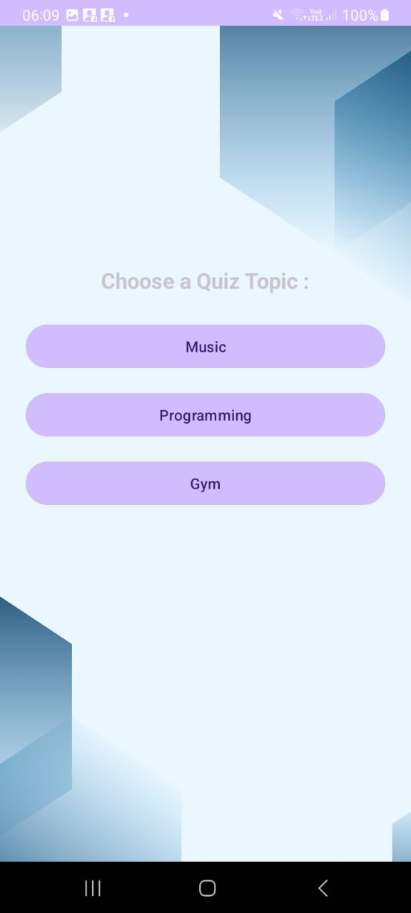

# 📱 QuizMaster - Android Quiz App

QuizMaster is an Android application that allows users to test their knowledge through multiple-choice quizzes on various themes like Programming, Music, and Gym. Users can register and log in via Firebase Authentication, select a topic, answer questions, and view their final score. The app includes a global timer to complete the quiz within a limited duration.

---

## 📌 Features

- 🔐 **User Authentication**: Register and Login using Firebase Authentication.
- 🎯 **Topic Selection**: Choose from different quiz categories (Programming, Music, Gym).
- ❓ **Multiple Choice Questions**: Answer a series of randomized questions.
- 🕒 **Timer**: A global countdown timer (1 minute) for the entire quiz.
- 📊 **Score Summary**: Final score is displayed at the end of the quiz.
- 🔁 **Replay Option**: Restart quiz after completion.

---

## 🛠️ Technologies Used

| Tech | Description |
|------|-------------|
| **Java** | Primary language used for Android development |
| **Android Studio** | IDE for Android application development |
| **Firebase Authentication** | User registration and login |
| **Firebase Realtime Database** | Stores quiz questions and answers |
| **XML** | Layout design for the UI |
| **Intents** | Navigation between activities |

---

## 📂 Project Structure

- **`LoginActivity.java`**  
  Manages user login via Firebase Authentication.

- **`RegisterActivity.java`**  
  Allows new users to create an account using Firebase Authentication.

- **`TopicSelectionActivity.java`**  
  Lets users select the quiz category before starting the quiz.

- **`QuizActivity.java`**  
  Core logic of the quiz:
   - Loads questions from Firebase
   - Displays them with options
   - Handles user answers
   - Starts the 1-minute countdown

- **`ScoreActivity.java`**  
  Displays the final score after quiz completion with options to restart.

---

## 🚀 How to Run

1. Clone the repository:
   ```bash
   git clone https://github.com/your-username/quizmaster-app.git

